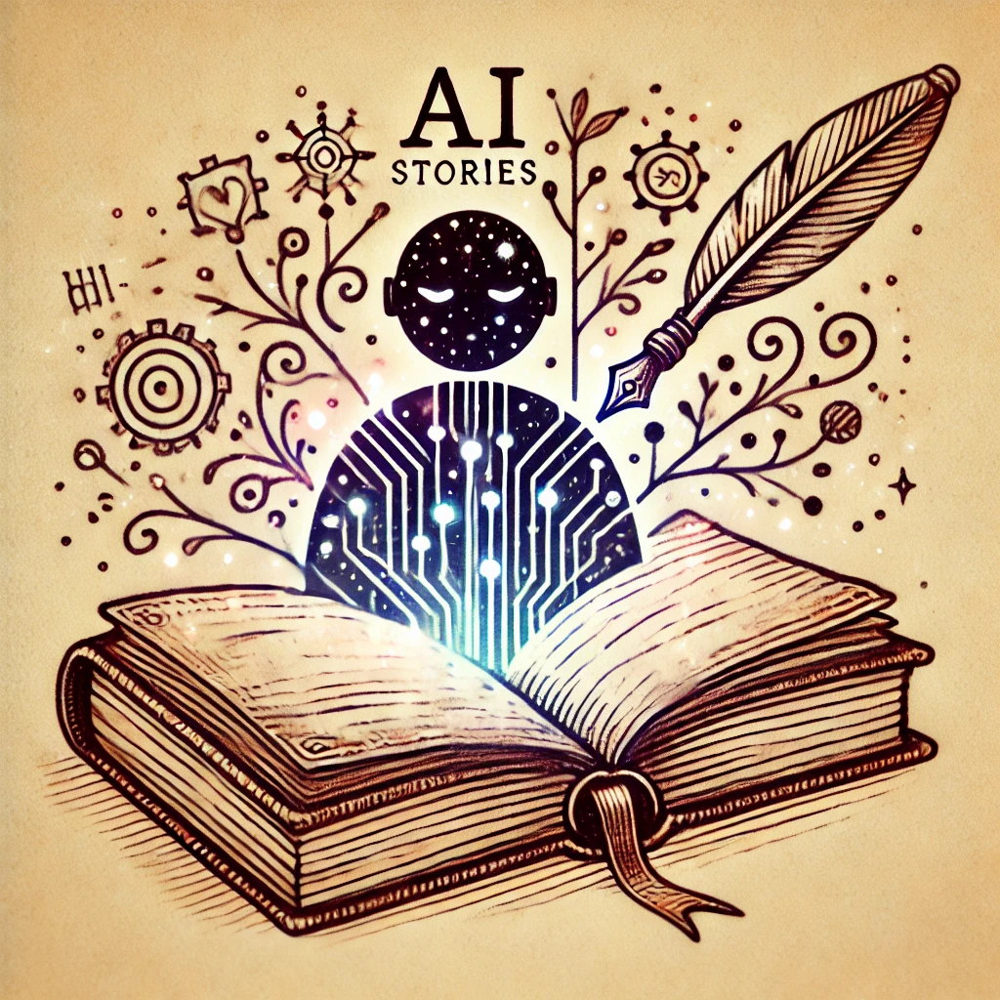
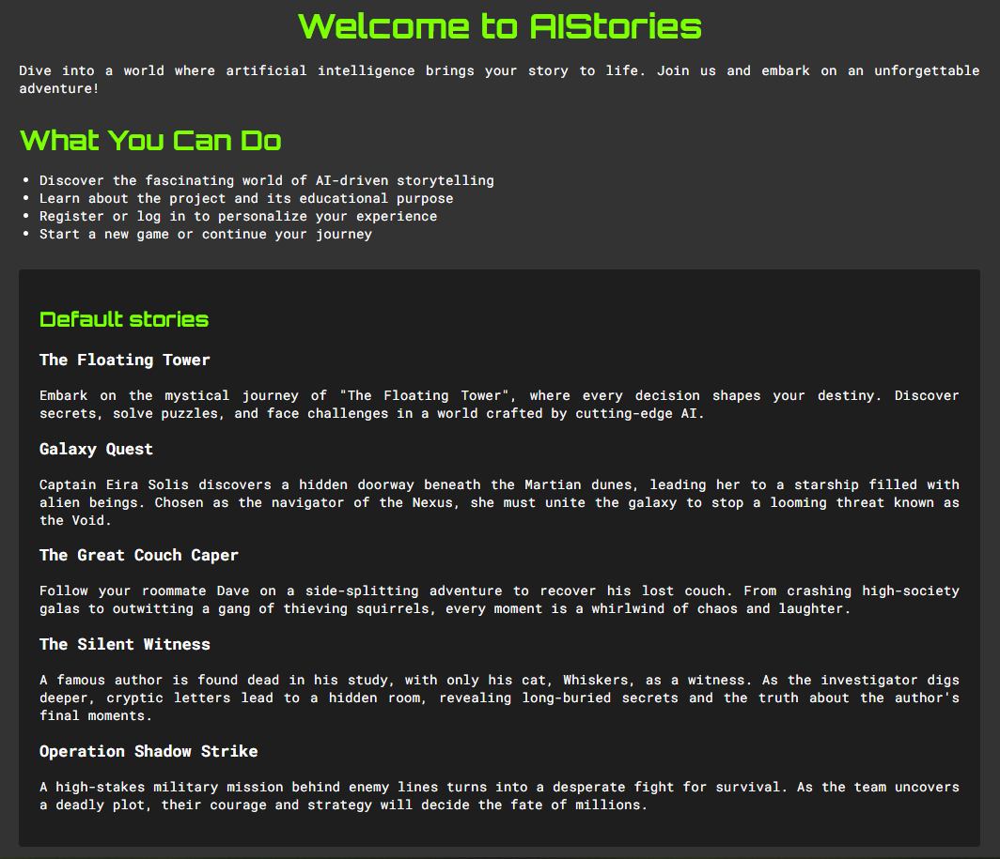

<a id="readme-top"></a>
[](https://github.com/akosszajb/AIStories/stargazers)
[](https://www.linkedin.com/in/akos-szajbert-7b489126b/)

<!-- PROJECT LOGO -->
<br />
<div align="center">
  <a href="https://github.com/akosszajb/AIStories">
    
  </a>

<h3 align="center">AIStories - Interactive storytelling with AI-generated text and images</h3>

  <p align="center">
   A MERN app
    <br />
    <a href="https://github.com/akosszajb/AIStories"><strong>Explore the docs »</strong></a>
    <br />
    <br />
   <a href="https://github.com/akosszajb/AIStories/issues/new?labels=bug&template=bug-report.md">Report Bug</a>
    ·
    <a href="https://github.com/akosszajb/AIStories/issues/new?labels=enhancement&template=feature-request.md">Request Feature</a>
  </p>
</div>

<!-- TABLE OF CONTENTS -->
<details>
  <summary>Table of Contents</summary>
  <ol>
    <li>
      <a href="#project-description">Project Description</a>
      <ul>
      <li><a href="#features">Features</a></li>
        <li><a href="#built-with">Built With</a></li>
      </ul>
    </li>
    <li>
      <a href="#getting-started">Getting Started</a>
      <ul>
        <li><a href="#prerequisites">Prerequisites</a></li>
        <li><a href="#installation">Installation</a></li>
      </ul>
    </li>
    <li><a href="#license">License</a></li>
    <li><a href="#contact">Contact</a></li>
    <li><a href="#acknowledgments">Acknowledgments</a></li>
  </ol>
</details>

<!-- PROJECT DESCRIPTION-->

<div align="center">
   
</div>

## Project Description

AI Stories is a text-based adventure game web application built using the MERN stack (MongoDB, Express, React, Node.js). The project utilizes AI-generated text and images to create interactive storytelling experiences for users.hands-on experience in the field of automated testing.

### Features

- User registration and authentication (login, logout)
- Character creation and management
- Create and edit your own base story
- AI-generated story progression
- Interactive decision-making
- Persistent game state saved in MongoDB
- AI-generated images for story scenes
- Custom AI-generated profile pictures
- Send your completed story via email

<p align="right">(<a href="#readme-top">back to top</a>)</p>

### Built With

List of the major frameworks/libraries/IDE used to bootstrap this project.

[](https://www.mongodb.com/)
[](https://expressjs.com/)
[](https://reactjs.org/)
[](https://nodejs.org/)
[](https://mongoosejs.com/)
[](https://tailwindcss.com/)
[](https://reactrouter.com/)
[](https://vitejs.dev/)
[](https://openai.com/)
[](https://ai.google/)
[](https://www.npmjs.com/package/bcrypt)
[](https://www.npmjs.com/package/cors)
[-8.5.1-yellowgreen>)](https://www.npmjs.com/package/jsonwebtoken)
[](https://nodemailer.com/)
[](https://github.com/)
[](https://www.thunderclient.com/)
[](https://jestjs.io/)
[](https://www.npmjs.com/package/supertest)
[](https://www.npmjs.com/package/mongodb-memory-server)
[](https://pollinations.ai/)

<p align="right">(<a href="#readme-top">back to top</a>)</p>

<!-- GETTONG STARTED -->

### Getting Started

This section will guide you through setting up the AIStories project locally. Follow these simple steps to get up and running.

### Prerequisites

Before you begin, make sure you have the following tools installed on your system:

- Node.js and npm installed
- MongoDB instance running (local or cloud)
- A Google API key for generating AI-driven content
- A Mail provider setup for email functionality (e.g., Nodemailer configuration)

Optional:

- Visual Studio Code (IDE for development)  
  Download VS Code from: https://code.visualstudio.com/

### Installation

#### Setup:

1. Clone the repository

```bash
git clone https://github.com/akosszajb/AIStories
```

2. In the project folder, run the following to install the dependencies:

```bash
npm install
```

3. Create a `.env` file to store your environment variables, such as MongoDB connection string and Google API keys. Example format:

```env
MONGO_URL=your_mongodb_connection_string
PORT=your_preferred_port
JWTKEY=your_jwt_secret_key
GEMINIKEY=your_google_api_key
EMAIL=your_email_address
EMAILPSW=your_email_password
EMAILPSW2=your_email_password2
```

4. Launch the backend server from the server folder:

```bash
node server.js
```

Launch the frontend script from the client folder:

```bash
npm run dev
```

5. In a browser, navigate to:

```
http://localhost:your_preferred_port/
```

Make sure both the backend and frontend servers are running.

### Test the Project:

- For backend API testing, you can use tools like Jest testing framework or Thunder Client.
- For email sending, use a mail provider like Gmail or configure your production email service.

<p align="right">(<a href="#readme-top">back to top</a>)</p>

<!-- LICENSE -->

## License

Distributed under the MIT License. See `LICENSE.txt` for more information.

<p align="right">(<a href="#readme-top">back to top</a>)</p>

<!-- CONTACT -->

## Contact

Akos Szajbert - kisszajbert@gmail.com

[LinkedIn](https://www.linkedin.com/in/akos-szajbert-7b489126b/)

Project Link: [https://github.com/akosszajb/AIStories](https://github.com/akosszajb/AIStories)

<p align="right">(<a href="#readme-top">back to top</a>)</p>

<!-- ACKNOWLEDGMENTS -->

## Acknowledgments

Resources I find helpful and would like to give credit to.

- [Best-README-Template](https://github.com/othneildrew/Best-README-Template)
- [W3Schools](https://www.w3schools.com/)
- [Codecool](https://codecool.com/en/)

<p align="right">(<a href="#readme-top">back to top</a>)</p>
